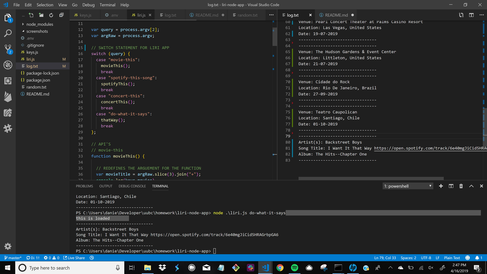

# liri-node-app

Looking for something like Google search but way less pretty and with far less queries available? Look no further. 

LIRI is here. 
version 1.01001100.01001001.01010010.01001001.00100000.01101001.01110011 00100000.01110001.01110101.01100101.01100101.01101110

Movies
Songs
Concerts
& Anyway You Would Like It

Before running liri you will need to supply your own .env file in order to access our features. Super convienent. Using the terminal while in the location of your liri app, simply start your search for the above topics by typing "node" followed by "./liri.js" 

+ To run a search for a movie, type "movie-this" followed by the movie of your choosing. 
"node ./liri.js movie-this Avatar"

+ Songs? "spotify-this-song" followed by the song title.
"node ./liri.js spotify-this-song Marching Bands of Manhattan"

+ Concerts? "concert-this" followed by the music artist.
"node ./liri.js concert-this Seal"

+ ??? "do-what-it-says" by itself
"node ./liri.js do-what-it-says"

If you have any questions make sure to check out my screenshots of the project to see how it works. DID YOU KNOW SEAL IS TOURING? HE"S TOURING.
LIRI educated me on that. You're welcome.